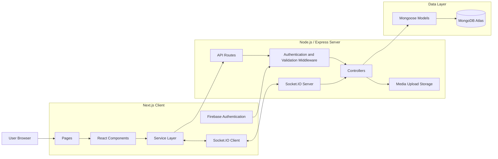

# Skillora

Skillora is a full-stack social learning platform where users can share skills, publish multimedia posts, join learning groups, communicate in real time, and track group engagement through interactive statistics.

The project demonstrates a complete client-server architecture using React, Next.js, Node.js, Express, MongoDB, Socket.IO, Firebase Authentication, Canvas, video, file uploads, and D3.js.

---

## Main Features

### Authentication and User Profiles

- User registration and login with Firebase Authentication
- Protected client pages
- Server-side token verification
- Skillora user profiles stored in MongoDB
- Profile pages with user information and activity

### Posts and Feed

- Personal posts and group posts
- Text posts
- Multiple image attachments
- Multiple video attachments
- YouTube and direct video URLs
- Canvas drawings
- Mixed posts containing photos, videos, and canvas content
- Edit and delete permissions
- Likes and comments
- Comment deletion
- Feed updates after post creation

### Groups and Permissions

- Create public or private groups
- Group membership requests
- Group invitations
- Approve or reject join requests
- Group manager permissions
- Group-specific feed
- Manager-only statistics page

### Real-Time Chat

- Private user-to-user conversations
- Conversation history
- Independent scrollable conversation list
- Real-time messages with Socket.IO
- Unread message counters
- Active conversation display

### Notifications

- Real-time notification badge
- Group invitations
- Join requests
- Join request approval and rejection
- Post likes
- Post comments
- Group post removal notifications
- Mark notifications as read

### Group Statistics with D3.js

Group managers can open a dedicated statistics page and choose the information they want to analyse.

Available statistics include:

- Posts by member
- Comments by member
- Likes received
- Members with no posts
- Total posts over time
- Activity for the last 24 hours, 7 days, or 30 days
- Daily average for weekly and monthly activity
- Top 5, Top 10, and Top 20 result limits

---

## Technology Stack

### Client

- Next.js 16
- React
- JavaScript
- CSS Modules
- Global CSS
- Firebase Authentication
- Socket.IO Client
- D3.js

### Server

- Node.js
- Express
- MongoDB
- Mongoose
- Firebase Admin SDK
- Socket.IO
- Multer

### Database and Storage

- MongoDB Atlas
- Local server upload directories for images and videos

---

## System Architecture

Skillora uses a client-server architecture.



### Request Flow

1. The user interacts with a Next.js page or React component.
2. The component calls a function from the client service layer.
3. The service sends an authenticated request to the Express API.
4. Authentication middleware verifies the Firebase ID token.
5. The controller validates the request and executes the business logic.
6. Mongoose models read or update MongoDB.
7. The server returns JSON to the client.
8. Socket.IO is used when an update must be delivered in real time.

---

## Project Structure

```text
skillora/
├── client/
│   ├── src/
│   │   ├── app/
│   │   │   ├── page.jsx
│   │   │   ├── login/
│   │   │   ├── register/
│   │   │   ├── profile/
│   │   │   ├── groups/
│   │   │   │   ├── page.jsx
│   │   │   │   ├── create/
│   │   │   │   └── [groupId]/
│   │   │   │       ├── page.jsx
│   │   │   │       └── statistics/
│   │   │   │           └── page.jsx
│   │   │   ├── chat/
│   │   │   ├── notifications/
│   │   │   └── search/
│   │   ├── components/
│   │   │   ├── NavigationBar.jsx
│   │   │   ├── ProtectedPage.jsx
│   │   │   ├── PostCard.jsx
│   │   │   ├── PostForm.jsx
│   │   │   ├── VideoPost.jsx
│   │   │   ├── CanvasEditor.jsx
│   │   │   ├── ChatWindow.jsx
│   │   │   ├── GroupCharts.jsx
│   │   │   └── GroupActivityChart.jsx
│   │   ├── services/
│   │   │   ├── ajaxService.js
│   │   │   ├── userService.js
│   │   │   ├── groupService.js
│   │   │   ├── postService.js
│   │   │   ├── messageService.js
│   │   │   ├── socketService.js
│   │   │   └── notificationService.js
│   │   └── styles/
│   │       ├── globals.css
│   │       └── cards.module.css
│   ├── package.json
│   └── .env.local
│
├── server/
│   ├── src/
│   │   ├── server.js
│   │   ├── app.js
│   │   ├── config/
│   │   │   └── database.js
│   │   ├── models/
│   │   │   ├── User.js
│   │   │   ├── Group.js
│   │   │   ├── Post.js
│   │   │   ├── Message.js
│   │   │   └── Notification.js
│   │   ├── controllers/
│   │   ├── routes/
│   │   ├── middleware/
│   │   └── sockets/
│   │       └── chatSocket.js
│   ├── uploads/
│   │   ├── images/
│   │   └── videos/
│   ├── package.json
│   └── .env
│
└── README.md
```

---

## Main Client Components

### `NavigationBar.jsx`

Displays the main navigation links, logout action, unread notification count, and unread chat count.

### `ProtectedPage.jsx`

Prevents unauthenticated users from accessing protected pages.

### `PostForm.jsx`

Creates text and multimedia posts. It supports multiple photos, multiple videos, URLs, and canvas content.

### `PostCard.jsx`

Displays a post, its attachments, author, group information, likes, comments, and management actions.

### `VideoPost.jsx`

Displays uploaded videos, direct video links, and supported embedded video URLs.

### `CanvasEditor.jsx`

Uses the HTML Canvas API to let users draw content and attach the result to a post.

### `ChatWindow.jsx`

Displays the conversation list, selected conversation, message history, unread counts, and real-time message composer.

### `GroupCharts.jsx`

Reusable D3 bar chart for member-based statistics such as posts, comments, and likes.

### `GroupActivityChart.jsx`

D3 activity chart that displays posts over time, total post count, and an average line for weekly and monthly periods.

---

## Main Server Layers

### Routes

Routes define the available API endpoints and connect each request to authentication, validation, upload middleware, and controllers.

### Middleware

Middleware handles:

- Firebase authentication
- Skillora user loading
- Request validation
- Image uploads
- Video uploads
- Permission checks

### Controllers

Controllers contain the application logic for users, groups, posts, messages, and notifications.

### Models

The MongoDB data model is implemented with Mongoose.

#### User

Stores user profile information and the connection to the Firebase account.

#### Group

Stores group information, privacy settings, manager details, members, invitations, and membership requests.

#### Post

Stores post content, author, group, attachments, likes, comments, and timestamps.

Attachment types include:

- `image`
- `video`
- `canvas`

#### Message

Stores private messages between users and supports conversation history and unread state.

#### Notification

Stores system notifications such as invitations, join requests, approvals, likes, comments, and removed posts.

### Socket.IO

Socket.IO provides real-time communication for:

- Private chat messages
- Unread chat updates
- New notifications
- Notification badge updates

---

## Prerequisites

Install the following software:

- Node.js 22 or newer
- npm 10 or newer
- Git
- A MongoDB Atlas account
- A Firebase project

Check the installed versions:

```bash
node --version
npm --version
git --version
```

---

## Environment Configuration

Do not commit real credentials or private keys.

### Client Environment

Create:

```text
client/.env.local
```

The exact variable names must match the Firebase and API configuration files in the client. A typical configuration is:

```env
NEXT_PUBLIC_API_URL=http://localhost:5000

NEXT_PUBLIC_FIREBASE_API_KEY=your_firebase_api_key
NEXT_PUBLIC_FIREBASE_AUTH_DOMAIN=your_project.firebaseapp.com
NEXT_PUBLIC_FIREBASE_PROJECT_ID=your_project_id
NEXT_PUBLIC_FIREBASE_STORAGE_BUCKET=your_project.appspot.com
NEXT_PUBLIC_FIREBASE_MESSAGING_SENDER_ID=your_sender_id
NEXT_PUBLIC_FIREBASE_APP_ID=your_app_id
```

### Server Environment

Create:

```text
server/.env
```

A typical server configuration is:

```env
PORT=5000
CLIENT_URL=http://localhost:3000
MONGODB_URI=your_mongodb_connection_string

FIREBASE_PROJECT_ID=your_project_id
FIREBASE_CLIENT_EMAIL=your_firebase_service_account_email
FIREBASE_PRIVATE_KEY="your_firebase_private_key"
```

The Firebase private key may contain escaped newline characters. Keep it inside quotes and preserve the `\n` characters when required by the server configuration.

---

## Installation

Clone the repository:

```bash
git clone https://github.com/RoeyZakharov/Skillora.git
cd Skillora
```

Install the server dependencies:

```bash
cd server
npm install
```

Install the client dependencies:

```bash
cd ../client
npm install
```

---

## Running the System

The server and client must run in separate terminals.

### Terminal 1 — Start the Server

```bash
cd server
npm run dev
```

When the server package does not define a `dev` script, use:

```bash
npm start
```

The API normally runs at:

```text
http://localhost:5000
```

### Terminal 2 — Start the Client

```bash
cd client
npm run dev
```

Open:

```text
http://localhost:3000
```

---

## Production Build

Build the client:

```bash
cd client
npm run build
```

Start the production client:

```bash
npm start
```

The build should include routes such as:

```text
/
/login
/register
/groups
/groups/[groupId]
/groups/[groupId]/statistics
/chat
/notifications
/search
/profile/[username]
```

---

## Uploaded Media

Images and videos are uploaded through the Express server with Multer.

Typical upload directories:

```text
server/uploads/images
server/uploads/videos
```

The server exposes these files through static upload routes so the client can display them in posts.

For a production deployment, local file storage should be replaced with persistent object storage such as Firebase Storage, Amazon S3, or another cloud storage provider.

---

## Permissions

### Authenticated User

An authenticated user can:

- View the feed
- Create posts
- Like and comment
- Join groups
- Send messages
- Receive notifications

### Group Member

An approved group member can:

- View private group content
- Publish group posts
- Participate in group discussions

### Group Manager

The group manager can:

- Manage members
- Review join requests
- Send invitations
- Remove group posts
- Open the manager-only statistics page
- View group participation and activity charts

Client-side visibility is used for the user interface, while server-side permission checks must protect restricted actions and data.

---

## Statistics

The statistics page is available at:

```text
/groups/<groupId>/statistics
```

Only the group manager can access it.

Available filters include:

- Statistic type
- Last 24 hours
- Last 7 days
- Last 30 days
- All time where supported
- Top 5
- Top 10
- Top 20

The charts are generated with D3.js and update when the manager changes the selected metric or period.

---

## Development Checks

Before committing changes, run:

```bash
cd client
npm run build
```

Check the repository status:

```bash
git status
```

Review staged changes:

```bash
git diff --cached
```

---

## Security Notes

- Never commit `.env` or `.env.local`.
- Never expose Firebase service-account credentials to the client.
- Always validate server input.
- Always check group and post permissions on the server.
- Restrict uploaded file types and sizes.
- Treat client-side permission checks as user-interface controls only.
- Use HTTPS in production.
- Configure allowed Socket.IO and API origins for the deployed client.

---

## Future Improvements

Possible future improvements include:

- Cloud media storage
- Message attachments
- Typing indicators
- Online presence
- Pagination or infinite scrolling
- Advanced search filters
- Automated tests
- Docker deployment
- Continuous integration
- Responsive statistics tables
- Exportable group reports

---

## Author

**Roey Zakharov**

GitHub: [RoeyZakharov](https://github.com/RoeyZakharov)

---

## License

This project was created for academic purposes.
